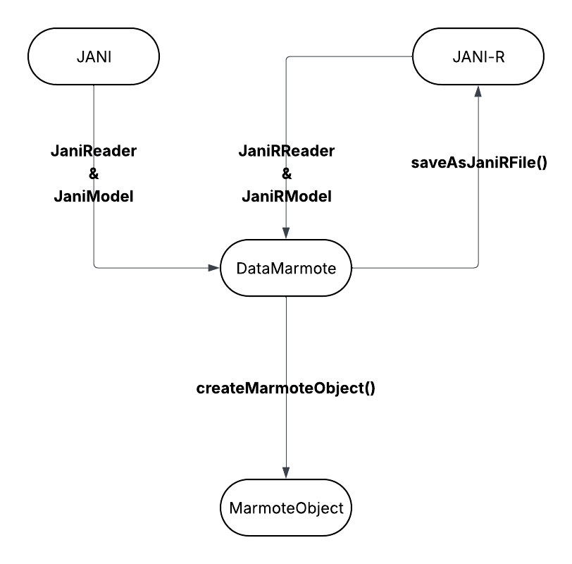

# AI2D project 2024-2025: Comparison of methods for solving MDPs on modeling language instances

## Description
**For this project, we primarily implemented a parser capable of translating a specific subset of JANI files into corresponding Marmote instances.** This parser does not support all the model types defined in the JANI specification; instead, it is limited to discrete-time Markov models, specifically **Discrete-Time Markov Chains (dtmc)** and **Discrete-Time Markov Decision Process (mdp)**.

We have also introduced **an extension to JANI**, named **JANIR**, since we've noticed that standard JANI files cannot represent all MDP model types. In particular, they are limited to the modeling of **shortest path or longest path MSPs**.

This project is carried out by **`Zeyu TAO`** and **`Jiahua LI`**, and supervised **`Mr Emmanuel HYON`** and **`Mr Pierre-Henri WUILLEMIN`**.

## Installation
To install via git
```bash
git clone git@github.com:bellkilo/pAI2D_mdp_languages.git
```

## Usage
### Baseline architecture


### JANI to Marmote instance
```python
from janiParser.reader.reader import JaniReader
from janiParser.dataMarmote.dataMarmote import DataMarmote

# Create an instance of JaniReader.
# This class requires at least the local file path or URL path of the target file.
# (Details about the JaniReader class are provided in ./janiParser/README.md file.)
# Example of using the URL path.
# reader = JaniReader("https://qcomp.org/benchmarks/mdp/philosophers-mdp/philosophers-mdp.3.jani", isLocalPath=False)
# Example of using the local path.
reader = JaniReader("./benchmarks/prism2jani/philosophers-mdp.3.v1.jani")

# Load and parse the target file to build an instance of JaniModel.
model = reader.build()

# Get all the data needed to build the Marmote instance.
# The `getMDPData` function takes as argument the name of the property to be modeled (JANI limitation).
MDPData = model.getMDPData("eat")

# Create an instance of DataMarmote using the data returned by `getMDPData` or `getMCData` function.
dataMarmote = DataMarmote(MDPData)

# Create the corresponding Marmote instance.
mdp = dataMarmote.createMarmoteObject()
```

### JANI to JANIR
```python
from janiParser.reader.reader import JaniReader
from janiParser.dataMarmote.dataMarmote import DataMarmote

# Create an instance of JaniReader.
# This class requires at least the local file path or URL path of the target file.
# (Details about the JaniReader class are provided in ./janiParser/README.md file.)
# Example of using the URL path.
# reader = JaniReader("https://qcomp.org/benchmarks/mdp/philosophers-mdp/philosophers-mdp.3.jani", isLocalPath=False)
# Example of using the local path.
reader = JaniReader("./benchmarks/prism2jani/philosophers-mdp.3.v1.jani")

# Load and parse the target file to build an instance of JaniModel.
model = reader.build()

# Get all the data needed to build the Marmote instance.
# The `getMDPData` function takes as argument the name of the property to be modeled (JANI limitation).
MDPData = model.getMDPData("eat")

# Create an instance of DataMarmote using the data returned by `getMDPData` or `getMCData` function.
dataMarmote = DataMarmote(MDPData)

########## ##########
# Save the current model as a .janir file.
dataMarmote.saveAsJaniRFile("./philosophers-mdp.3.v1.janir")
```

### JANIR to Marmote instance
```python
from janiParser.reader.reader import JaniRReader
from janiParser.dataMarmote.dataMarmote import DataMarmote

# Create an instance of JaniRReader.
# This class works in the same way as JaniReader, but it does not support the URL path,
# which only takes as argument the local file path of the target file.
reader = JaniReader("./philosophers-mdp.3.v1.janir")

# Load and parse the target file to build an instance of JaniRModel.
model = reader.build()

# Get all the data needed to build the Marmote instance.
# The `getMDPData` fucntion written in the JaniRModel class takes no arguments,
# since it defines an MDP in a general way, so there's no property to specify.
MDPData = model.getMDPData()

# Create an instance of DataMarmote using the data returned by `getMDPData` or `getMCData` function.
dataMarmote = DataMarmote(MDPData)

# Create the corresponding Marmote instance.
mdp = dataMarmote.createMarmoteObject()
```

## Description of main source files
We provide the brief description of each main source file used in the project, along with the classes implemented in them (**Detailed documentation for each class is available in the `./janiParser/README.md` file.**)
* **`janiParser/reader/reader.py`**:

    **This file contains the main implementation for parsing JANI or JANIR files.** It includes `JaniReader` and `JaniRReader` classes, which are responsible for reading and interpreting both JANI and extended JANIR models from a local file path or from a URL path (specifically if the JANI file is available at `https://qcomp.org/benchmarks/`).

* **`janiParser/reader/model.py`**:

    **This file defines two main classes, `JaniModel` and `JaniRModel`**, which encapsulate the internal structure of the JANI and JANIR files respectively. These classes provide two main methods, `getMDPData`and `getMCData`, which extract data from the JANI or JANIR structure and return relevant data in the form of a Python dictionary (**See `./janiParser/README.md` for more details**).

* **`janiParser/dataMarmote/dataMarmote.py`**:

    **This file contains a single class, `DataMarmote`**, which serves as an intermediary between JANI or JANIR files and Marmote instances. This class primarily handles the translation of data extracted from JANI or JANIR models into a format compatible with Marmote, and also supports conversion from standard JANI to its extended JANIR form.

* **`janiParser/utils.py`**: