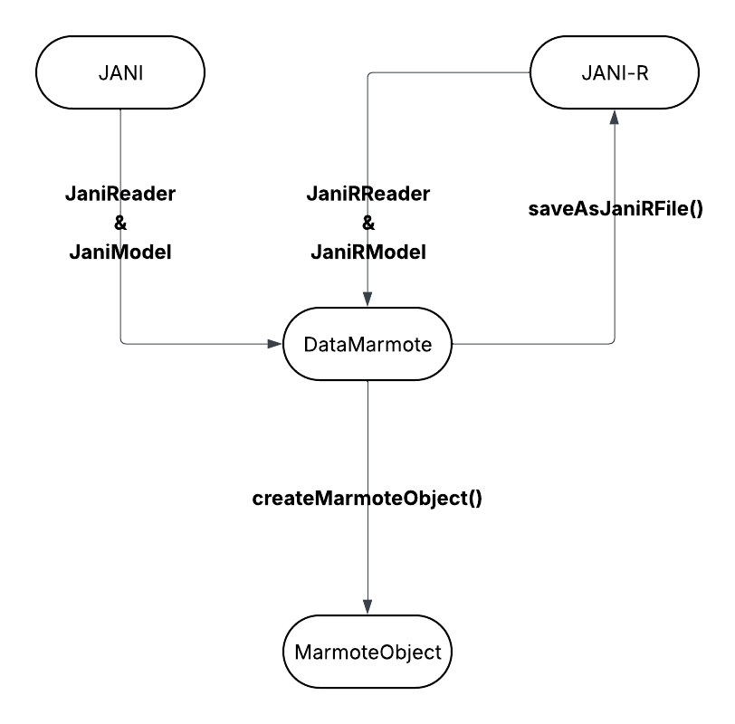

# AI2D Project 2024-2025: Comparison of Methods for Solving MDPs on Modeling Language Instances

## Project Overview
**For this project, we primarily implemented a parser that translates a specific subset of JANI files into corresponding Marmote instances.** This parser does not support the full JANI specification; it is limited to discrete-time Markov models, specifically **Discrete-Time Markov Chains (DTMC)** and **Discrete-Time Markov Decision Processes (MDP)**.  
We also introduce an extension to JANI, named JANI-R, to overcome the expressiveness limitations of the standard JANI format for MDP modeling. Unlike the original JANI specification, which only supports shortest or longest path objectives, JANI-R enables a more general representation of MDPs.

This project was carried out by **`Zeyu TAO`** and **`Jiahua LI`**, under the supervision of **`Mr. Emmanuel HYON`** and **`Mr. Pierre-Henri WUILLEMIN`**.

## Installation
### Prerequistes
* **[marmote](https://marmote.gitlabpages.inria.fr/marmote/index.html)**
* **[pymdptoolbox](https://pymdptoolbox.readthedocs.io/en/latest/index.html)**
* **[numpy](https://numpy.org)**
* **[scipy](https://scipy.org)**

To install the above dependencies, use the following command:
```bash
conda install -c marmote -c conda-forge  marmote=1.2.0
pip install pymdptoolbox, numpy, scipy
```

### Installation via Git
```bash
git clone git@github.com:bellkilo/pAI2D_mdp_languages.git
```

### Installation via Pip
```bash
pip install git+https://github.com/bellkilo/pAI2D_mdp_languages
```

## Usage
### System Architecture


### JANI $\rightarrow$ Marmote Instance
```python
import janiParser

# Initialize reader.
# This class requires at least the local file path or URL path to the target file.
# (See janiParser/doc.md for more details about the JaniReader class.)
# Example of using the local file path.
# reader = janiParser.JaniReader("./benchmarks/prism2jani/philosophers-mdp.3.v1.jani")

# Example of using the URL path.
reader = janiParser.JaniReader("https://qcomp.org/benchmarks/mdp/philosophers-mdp/philosophers-mdp.3.jani", isLocalPath=False)

model = reader.build()
# The getMDPData(...) function takes as argument the name of the property
# to be modeled. (JANI limitation.)
# Note that a JANI file may define multiple properties,
# and each of which can correspond to a distinct instance of the MDP problem.
MDPData = model.getMDPData("eat")

dataMarmote = janiParser.DataMarmote(MDPData)
mdp = dataMarmote.createMarmoteObject()
```

### JANI $\rightarrow$ JANI-R
```python
# Save as extended format JANI-R.
dataMarmote.saveAsJaniRFile("./output.janir")
```

### JANI-R $\rightarrow$ Marmote Instance
```python
# This class works in the same way as JaniReader, but it does not support the URL path,
# which only takes as argument the local file path to the target file.
reader = janiParser.JaniRReader("./output.janir")

model = reader.build()
# Since JANI-R defines MDPs generally, no specific property needs to be specified.
MDPData = model.getMDPData()

dataMarmote = janiParser.DataMarmote(MDPData)
mdp = dataMarmote.createMarmoteObject()
```

### Benchmarking
```python
_fullModelName = "consensus.2.jani"
_srcName = "QComp"
_modelParams = { "K": 10 }
_resolMethods = ["ValueIteration", "ValueIterationGS", "PolicyIterationModified"]
_reps = 20
_discount = .95
_epsilon = 1e-3
_maxIter = 1_000_000_000
_maxInIter = 10

res  = janiParser.benchmarkJaniMDPModel(_fullModelName,
                                        solverName="Marmote",
                                        # The following parameters are optional.
                                        srcName=_srcName,           # Indicate the benchmark source, currently only "QComp" sources are recognized.
                                        modelParams=_modelParams,
                                        replace=True,
                                        resolMethods=_resolMethods,
                                        reps=_reps,                 # Number of repetitions.
                                        discount=_discount,
                                        epsilon=_epsilon,
                                        maxIter=_maxIter,           # Number of maximum iterations.
                                        maxInIter=_maxInIter)       # Number of maximum inner iterations. (for modified policy methods)
print(res)
# [{'name': 'consensus.2.c1', 'number-of-states': 1296, 'number-of-actions': 3, 'ValueIteration': 0.002315044403076172, 'ValueIterationGS': 0.001195836067199707, 
# 'PolicyIterationModified': 0.011821019649505615}, {'name': 'consensus.2.c2', 'number-of-states': 1296, 'number-of-actions': 3, 'ValueIteration': 0.002155637741088867, 
# 'ValueIterationGS': 0.0011690855026245117, 'PolicyIterationModified': 0.013560998439788818}, {'name': 'consensus.2.disagree', 'number-of-states': 1296, 
# 'number-of-actions': 3, 'ValueIteration': 0.0021880507469177247, 'ValueIterationGS': 0.0011899828910827636, 'PolicyIterationModified': 0.011802744865417481}, {'name': 
# 'consensus.2.steps_max', 'number-of-states': 1296, 'number-of-actions': 3, 'ValueIteration': 0.005042576789855957, 'ValueIterationGS': 0.0027849316596984864, 
# 'PolicyIterationModified': 0.01600644588470459}, {'name': 'consensus.2.steps_min', 'number-of-states': 1296, 'number-of-actions': 3, 'ValueIteration': 0.
# 005023396015167237, 'ValueIterationGS': 0.0026710152626037596, 'PolicyIterationModified': 0.01613408327102661}]


res  = janiParser.benchmarkJaniMDPModel(_fullModelName,
                                        solverName="MDPToolbox",
                                        # The following parameters are optional.
                                        srcName=_srcName,           # Indicate the benchmark source, currently only "QComp" sources are recognized.
                                        modelParams=_modelParams,
                                        replace=True,
                                        resolMethods=_resolMethods,
                                        reps=_reps,                 # Number of repetitions.
                                        discount=_discount,
                                        epsilon=_epsilon,
                                        maxIter=_maxIter,           # Number of maximum iterations.
                                        maxInIter=_maxInIter)       # Number of maximum inner iterations. (for modified policy methods)
print(res)
# [{'name': 'consensus.2.c1', 'number-of-states': 1296, 'number-of-actions': 3, 'ValueIteration': 0.003072166442871094, 'ValueIterationGS': 4.449053013324738, 
# 'PolicyIterationModified': 4.976987838745117e-05}, {'name': 'consensus.2.c2', 'number-of-states': 1296, 'number-of-actions': 3, 'ValueIteration': 0.0031478404998779297, 
# 'ValueIterationGS': 4.4206886172294615, 'PolicyIterationModified': 5.385875701904297e-05}, {'name': 'consensus.2.disagree', 'number-of-states': 1296, 'number-of-actions': 
# 3, 'ValueIteration': 0.003268909454345703, 'ValueIterationGS': 4.2764752268791195, 'PolicyIterationModified': 5.2940845489501956e-05}, {'name': 'consensus.2.steps_max', 
# 'number-of-states': 1296, 'number-of-actions': 3, 'ValueIteration': 0.0054837226867675785, 'ValueIterationGS': 7.362779879570008, 'PolicyIterationModified': 4.
# 925727844238281e-05}, {'name': 'consensus.2.steps_min', 'number-of-states': 1296, 'number-of-actions': 3, 'ValueIteration': 0.005443894863128662, 'ValueIterationGS': 7.
# 392302370071411, 'PolicyIterationModified': 4.929304122924805e-05}]
```

## Project Structure
```
janiParser
├── README.md
├── __init__.py                 # Package initializer.
├── dataMarmote.py              # Implementation of the DataMarmote class.
├── doc.md                      # Documentation of core classses.
├── exception.py                # Custom exception classes.
├── reader
│   ├── __init__.py
│   ├── automata.py
│   ├── expression.py
│   ├── function.py
│   ├── model.py                # Implementations of JaniModel and JaniRModel classes.
│   ├── property.py
│   ├── reader.py               # Implementations of JaniReader and JaniRReader classes.
│   ├── state.py
│   └── variable.py
└── utils.py                    # Utility fonctions for benchmarking automation.
```

### Description of main source files
* **`janiParser/reader/reader.py`**:

    This file provides the **core implementation for parsing JANI and JANIR files**. It includes the classes `JaniReader` and `JaniRReader`, which are responsible for **loading and interpreting models** from either a **local file path** or a **URL path**, particularly when the `.jani` file is available online at `https://qcomp.org/benchmarks/`.

* **`janiParser/reader/model.py`**

    This file defines the `JaniModel` and `JaniRModel` classes, which represent the **internal structure** of standard JANI and extended JANIR models. These classes provide two key methods: `getMDPData` and `getMCData`. **(See [documentation](doc.md) for more details)**

* **`janiParser/dataMarmote.py`**

    This file contains a single class, `DataMarmote`, which serves as an **intermediary between JANI/JANIR models and Marmote instances**. It handles the **conversion of extracted data into a format compatible with Marmote**, and also supports translating standard JANI models into their extended JANIR form.

* **`janiParser/utils.py`**

    **This file includes a set of help functions used to automate benchmarking.**

### Resources
| Resource | Description |
| -------- | ----------- |
| **[Core Classes Documentation](doc.md)** | Detailed documentation for all core classes and utility functions |
| **[JANI Specification](https://jani-spec.org/)** | Official model specification for JANI files |
| **[Marmote Python API Documentations](https://marmote.gitlabpages.inria.fr/marmote/python_api.html)** | Marmote API documentations |
|**[MDPToolbox API Documentations](https://pymdptoolbox.readthedocs.io/en/latest/api/mdp.html)** | MDPToolbox API documentations |
